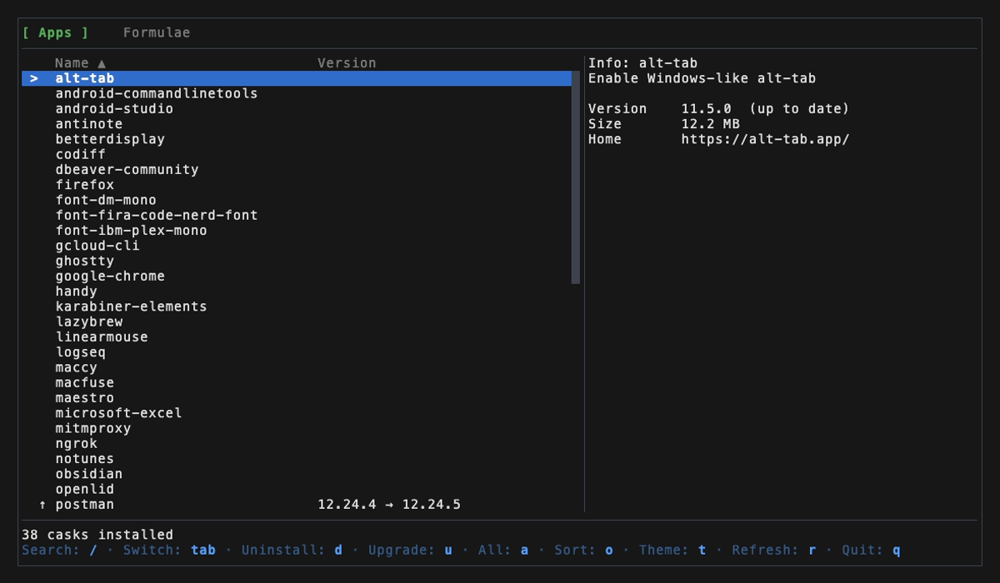
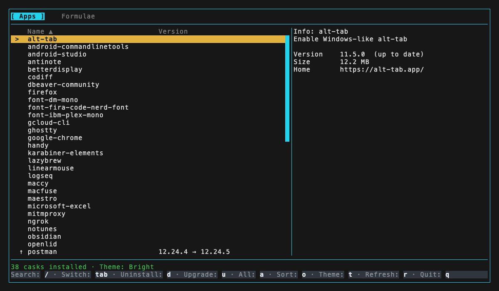
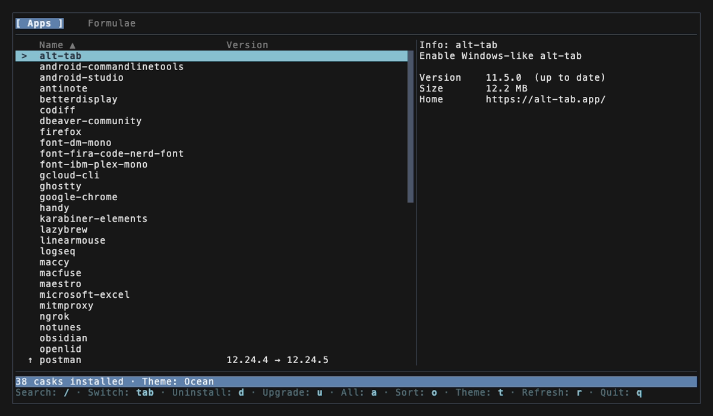

# lazybrew

**lazygit for your Homebrew packages — see what's installed, what's outdated, and what's eating your disk.**

   


## Why

`brew` answers questions one package at a time. lazybrew answers the fleet-sized ones at a glance: which of 300 formulae are stale, which ten are hogging 9 GB of Cellar, what breaks if this one goes — and then uninstalls or upgrades with a confirmation designed to be hard to fat-finger.

## Features

- **Instant startup** — the last session's inventory paints in the first frame from an on-disk snapshot, then refreshes underneath. No more staring at "Loading…".
- **Outdated, with the actual versions** — `↑` marks plus `12.24.4 → 12.24.5` right in the row, straight from `brew outdated`. Never `--greedy`, so it will not claim an auto-updating cask is stale.
- **Size accounting** — every formula's installed size from one `du` pass over the Cellar, with the fleet total. Casks are deliberately unsized: their Caskroom entries lie, and lazybrew does not print numbers that are not sizes.
- **A real table** — column headings with a sort cue; `o` cycles name ↑ → size ↓ → size ↑ → name ↓ per screen.
- **Untrusted-tap marks** — `!` on packages whose third-party tap Homebrew refuses to load, with brew's own `brew trust` remedy shown in the info pane.
- **Removal verdicts** — the info pane shows what depends on a formula and whether it is safe to remove.
- **Queue actions, keep browsing** — the list stays navigable while an uninstall or upgrade runs; confirm more actions and they queue up and run serially, shown live at the bottom of the info pane.
- **Dependency X-ray** — formulae installed as dependencies are hidden by default; `a` reveals them.
- **Four themes**, adapted to your terminal's light or dark background. `NO_COLOR` respected.

## Install

```sh
brew install todor-a/tap/lazybrew
lazybrew
```

Upgrade or remove lazybrew itself with `brew upgrade --cask lazybrew` / `brew uninstall --cask lazybrew`.

## Keys

| Browse | |
| --- | --- |
| `↑`/`k`, `↓`/`j` | Move; the info pane follows |
| `Tab` | Switch between Apps (casks) and Formulae |
| `/` or `s` | Search (substring, case-insensitive) |
| `a` | Show/hide dependency-only formulae |
| `o` | Cycle the sort: name ↑ · size ↓ · size ↑ · name ↓ |
| `t` | Cycle the theme (persisted) |
| `r` | Refresh from Homebrew |
| `q` | Quit |

| Act | |
| --- | --- |
| `d` | Uninstall the selected package (confirm first) |
| `u` | Upgrade the selected package — only offered when Homebrew reports it outdated |

While an action runs you can keep browsing, and `d`/`u` on other rows queues them.

In search: type to filter, `Enter` keeps the query, `Esc` clears it, `Tab` completes a partial `is:` filter (the status row shows the completion) and otherwise switches kind with the query intact.

## Safety

Uninstall and upgrade are delegated to `brew` — lazybrew never constructs shell commands, and package names are validated before they reach an argv.

The confirmation is deliberately strict: **only lowercase `y` proceeds**. `Y`, `Enter`, `Esc`, `q` — everything else cancels. If Homebrew needs administrator rights, lazybrew shows a masked password dialog inside the TUI; the password is handed to Homebrew's askpass mechanism and is never cached, logged, or written anywhere else. Cancelling mid-run also drops everything still queued — destructive work never continues past a cancel.

## Themes

<details>
<summary>Lazygit (default) · Bright · Ocean · Dracula</summary>

| | |
| --- | --- |
|  |  |
|  |  |

</details>

## Requirements

- macOS (Apple silicon or Intel), Homebrew on `PATH`.
- An interactive terminal, at least 32×9.

## Development

```sh
go build -o lazybrew ./cmd/lazybrew   # Go 1.27
go test ./...
```

The opt-in black-box suite drives the compiled TUI through a real macOS PTY and real Homebrew. It creates only the uniquely named `lazybrew/e2e` tap and `lazybrew-e2e-*` packages, then removes them:

```sh
go test -count=1 -tags=e2e ./e2e
```

Run via `go run ./cmd/lazybrew` and the log at `~/lazybrew/lazybrew.log` switches to debug — JSON lines with every brew command and its duration. The demo GIF and theme screenshots are recorded with [vhs](https://github.com/charmbracelet/vhs) from the tapes in `.github/`.

<details>
<summary>Release automation</summary>

Tags matching `v*` run release CI for macOS ARM and Intel. GoReleaser publishes the platform archives, checksums, and release notes, then generates the cask used by the Homebrew tap. The tap update is pushed with a deploy key scoped to that tap repository.

</details>
